| Nama      | Aditya Bani Isro |
| ----------- | ----------- |
| NIM     | 312010134       |
| Kelas   | TI.20.A.1        |

# Praktikum 2 | CSS Dasar

## Langkah langkah praktikum 2
Membuka text editor, Disini saya menggunakan Atom

## 1. Membuat Dokumen HTML
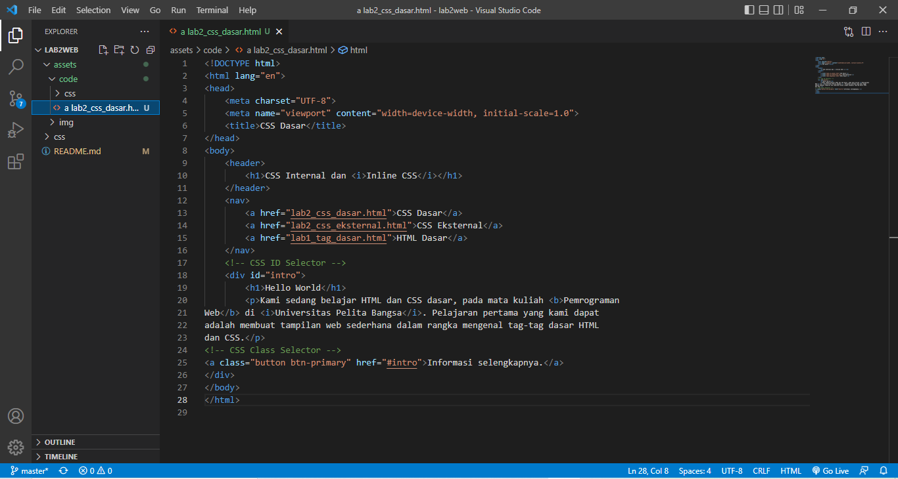

Buka pada browser untuk melihat hasilnya

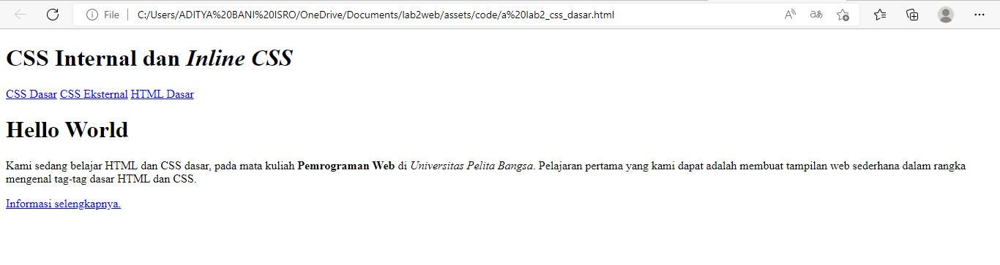

## 2. Mendeklarasikan CSS Internal
Kemudian tambahkan deklarasi CSS internal seperti berikut pada bagian head dokumen.
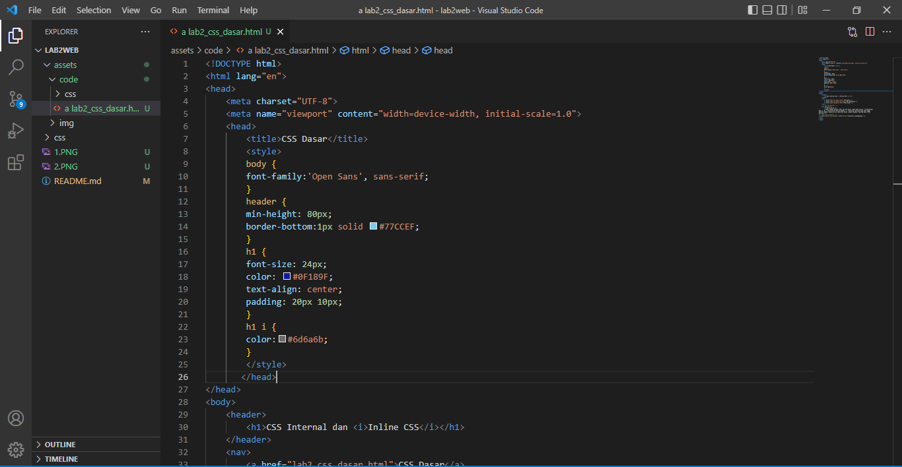

Selanjutnya simpan perubahan yang ada, dan lakukan refresh pada browser untuk melihat 
hasilnya.

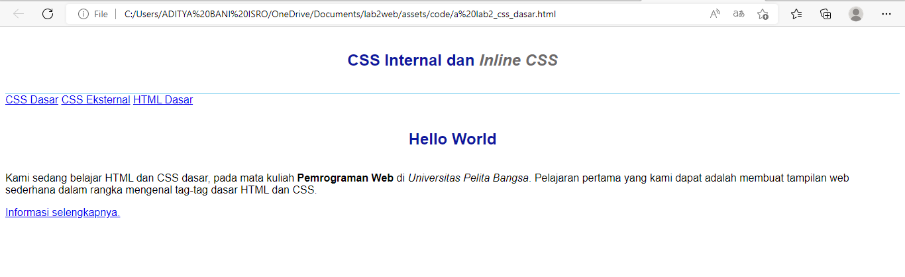

simpan perubahan yang ada, dan lakukan refresh pada browser untuk melihat hasilnya

## 3. Menambahkan Inline CSS
tambahkan deklarasi inline CSS pada tag `
` seperti berikut

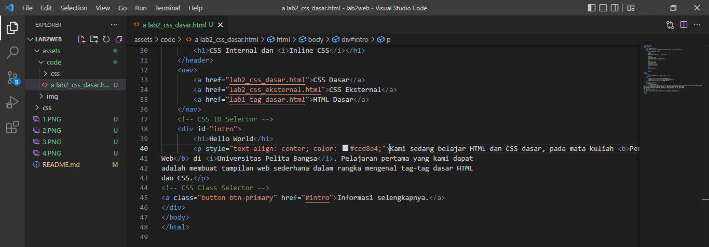

Refresh kembali browser untuk melihat perubahannya

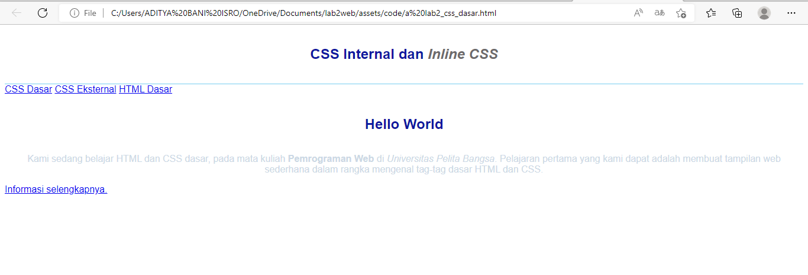

## 4. Membuat CSS Eksternal
Buatlah file baru dengan nama style_eksternal.css kemudian buatlah deklarasi CSS seperti berikut

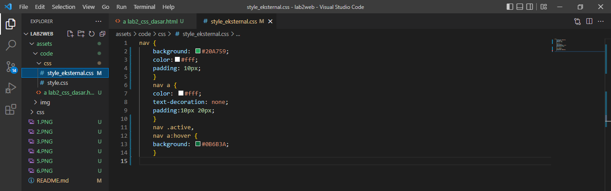

Kemudian tambahkan tag `<link>` untuk merujuk file css yang sudah dibuat pada bagian `<head>`

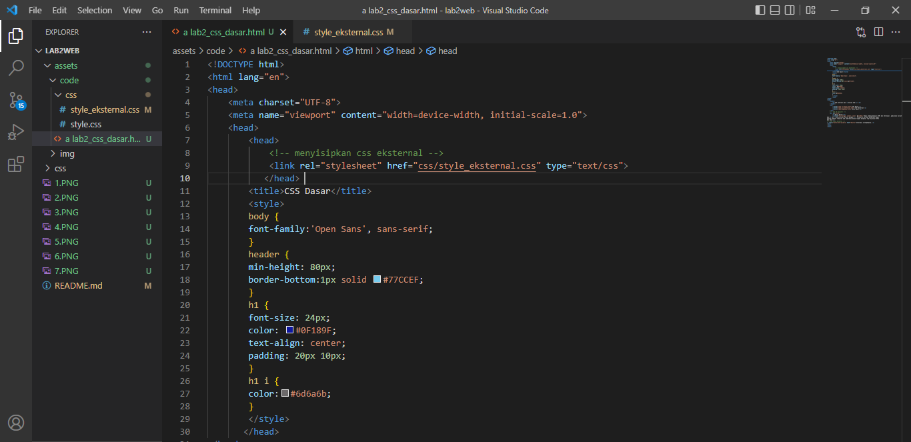

Selanjutnya refresh kembali browser untuk melihat perubahannya.

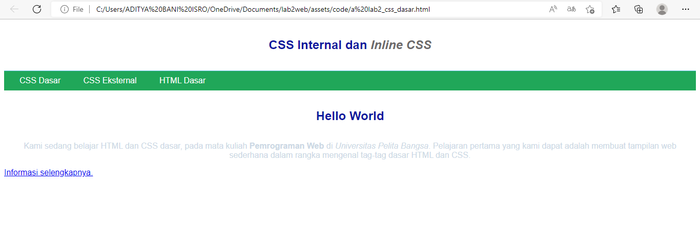

## 5. Menambahkan CSS Selektor
Selanjutnya menambahkan CSS Selector menggunakan ID dan Class Selector. Pada file style_eksternal.css, tambahkan kode berikut

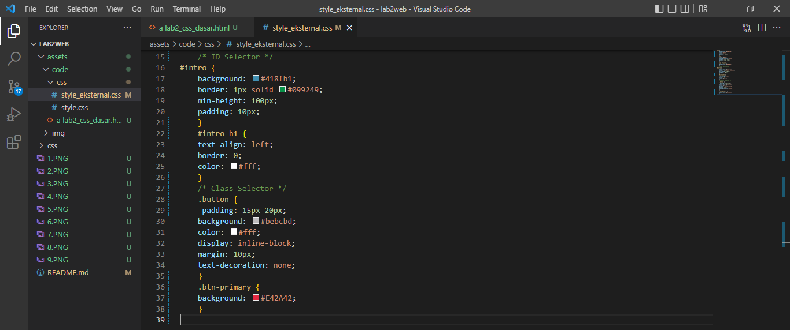

Kemudian simpan kembali dan refresh browser untuk melihat perubahannya

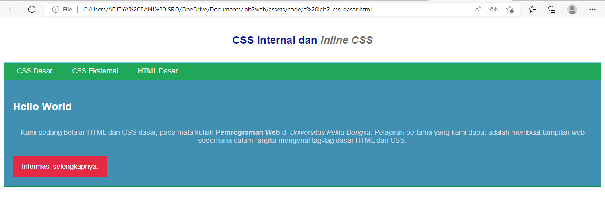

## Pertanyaan dan Tugas
1. Lakukan eksperimen dengan mengubah dan menambah properti dan nilai pada kode CSS dengan mengacu pada CSS Cheat Sheet yang diberikan pada file terpisah dari modul ini.
2. Apa perbedaan pendeklarasian CSS elemen h1 {...} dengan #intro h1 {...}? berikan penjelasannya!
3. Apabila ada deklarasi CSS secara internal, lalu ditambahkan CSS eksternal dan inline CSS pada elemen yang sama. Deklarasi manakah yang akan ditampilkan pada browser? Berikan penjelasan dan contohnya!
4. Pada sebuah elemen HTML terdapat ID dan Class, apabila masing-masing selector tersebut terdapat deklarasi CSS, maka deklarasi manakah yang akan ditampilkan pada browser? Berikan penjelasan dan contohnya! ( `
` )

## Jawab
1. Saya akan mengubah dan menambah properti dan nilai pada kode CSS, dimulai dari membuat kerangka html nya

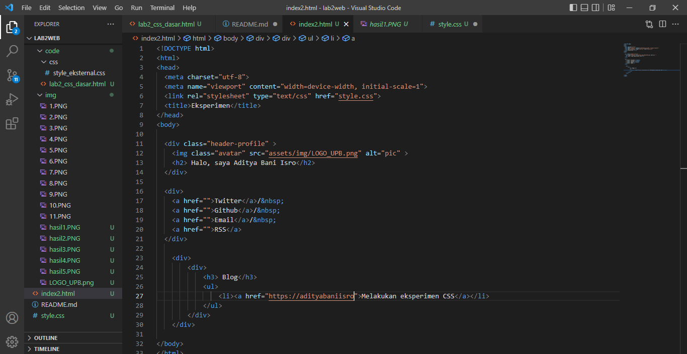
	
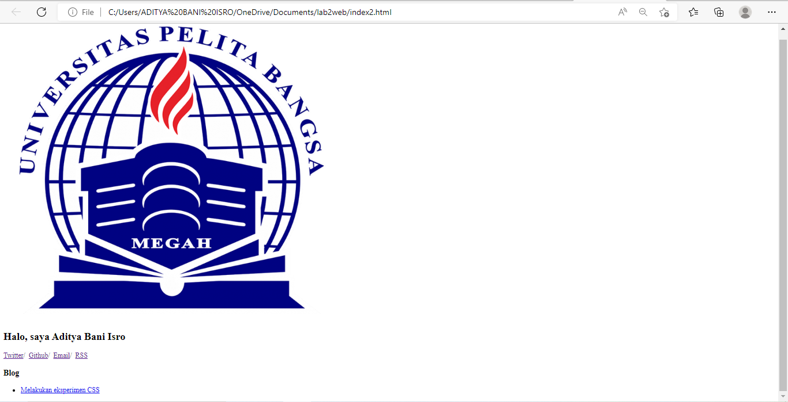

Kemudian membuat CSS nya dengan menambah properti dan nilai pada kode

Saya menambahkan 4 selektor ke dalam CSS, diantaranya body, h2, .avatar, .header-profile. Masing-masing memiliki fungsi untuk mengatur tampilan pada html

pada selektor body saya menambahkan beberapa properti, yaitu margin, width, font-size, color, dst.

selektor h2, properti font-weight, font-size

selektor .avatar, properti width, border-radius

selektor .header-profile, display, justify-content, align-items

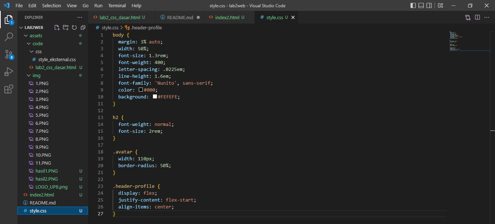

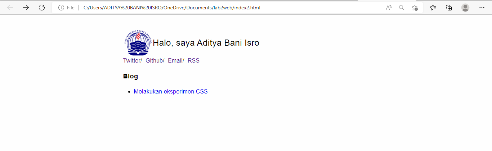

Pada hasil tersebut dapat dilihat, pada mode mobile lebar body terlalu ke tengah, karena widht pada selektor body diatur dengan nilai 50% pada ukuran desktop, agar dapat terlihat proporsional pada ukuran mobile dapat ditambahkan selektor `@media only screen and (max-width: 760px)`, dan hasil nya bisa dilihat

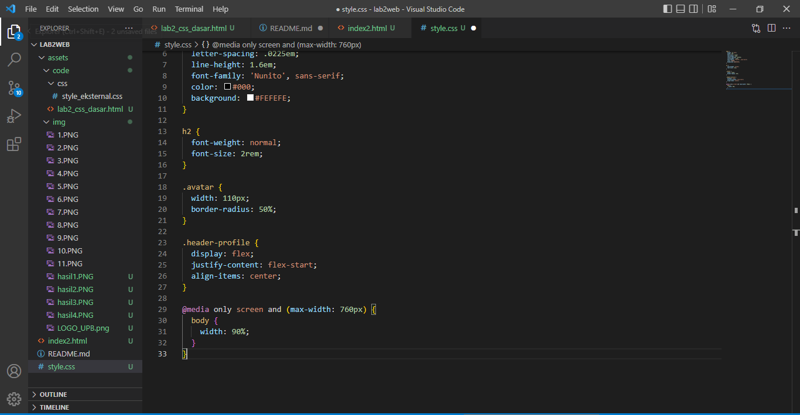

2. `h1{}` Untuk memberikan style pada semua element h1

`#intro h1{}` Awalan simbol hash (#) memungkinkan kita untuk memberi style pada id.
selector id bersifat kaku dan tidak bisa digunakan kembali pada element yang lainnya. Menurut saya lebih baik gunakan selektor class untuk mendefinisikan element yang ingin diberi nilai.
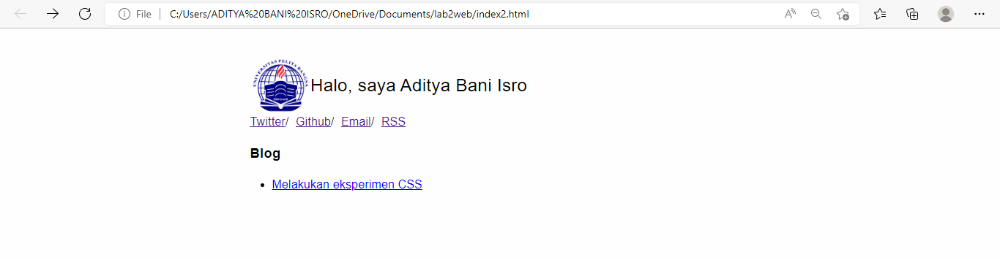

3. jika ketiga CSS merubah elemen yang sama maka deklarasi tersebut akan mengikuti aturan prioritas dimana prioritas CSS nya seperti ini:

	1. inline CSS
	2. ID selector CSS
	3. internal CSS
	4. external CSS
contoh:

Ini adalah tampilan coding pada html testing dimana terdapat 2 kalimat yang memiliki elemen yang sama yaitu h1:

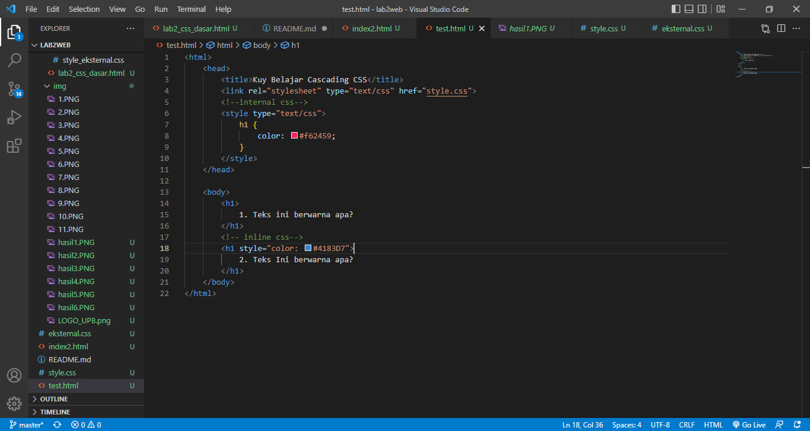

sedangkan eksternal css berupa 
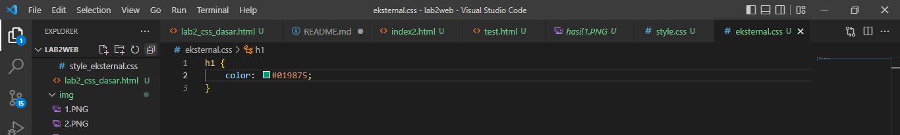

Dan hasilnya adalah :
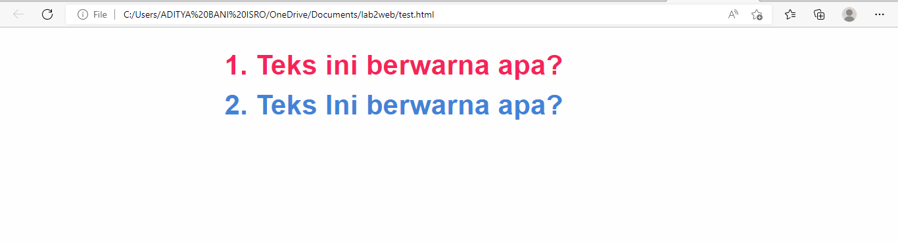

4. Hasilnya sesuai dengan kesimpulan saya sebelumnya semakin spesifik css tersebut maka akan semakin tinggi prioritas css tersebut
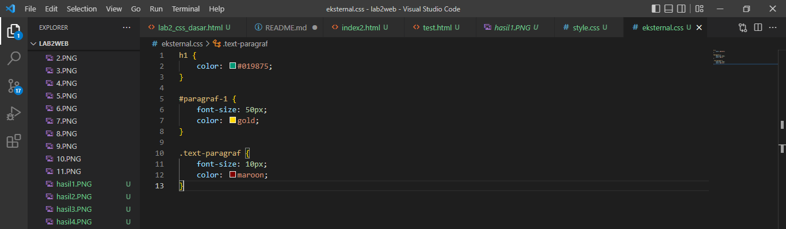
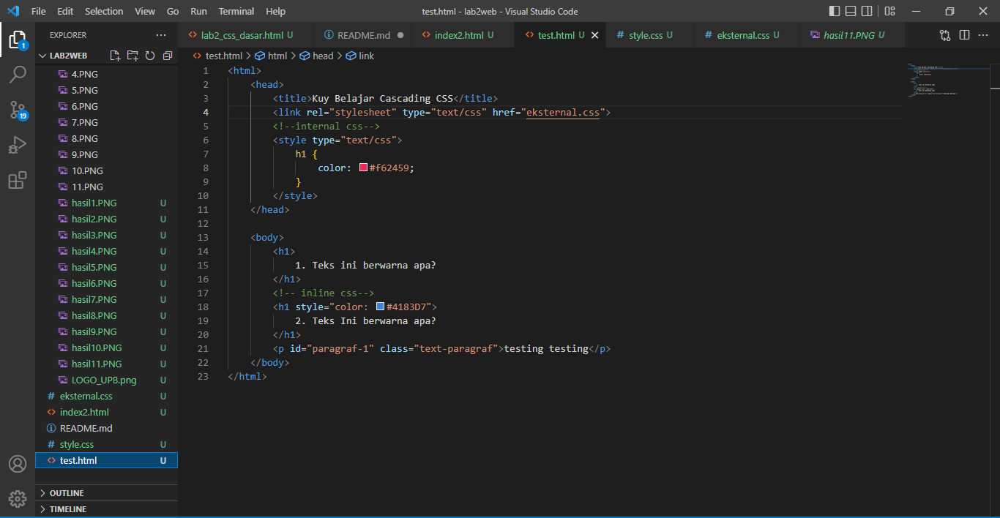

disitu bisa dilihat terdapat 2 css yang merujuk ke elemen yang sama tapi 1 merujuk dengan id yang birisi font 40 dan warna emas sedangkan yang satu lagi merujuk dengan class yang berisi font 10 dan warna maroon hasilnya adalah:

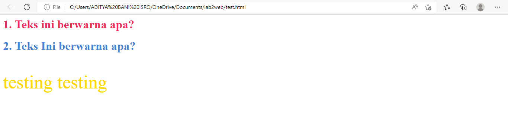